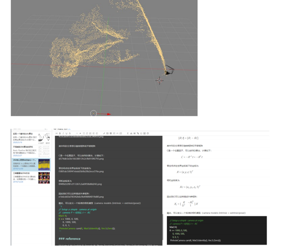

# SfM_document

>从一组2Dmotion中恢复structure，实现三维重建过程中稀疏点云的重建过程

研究文档（个人写作，供学习分享，请勿用于商业用途）在该分支下文件夹SfM中存储

* 调研国外文献，梳理SfM的主流研究，形成综述文档，对涉及的重要算法进行研究并测试
* 在开源可视化软件blender上整合开源软件osm-bundler，对et和mask数据集实现稀疏点云重建
# 文档预览

